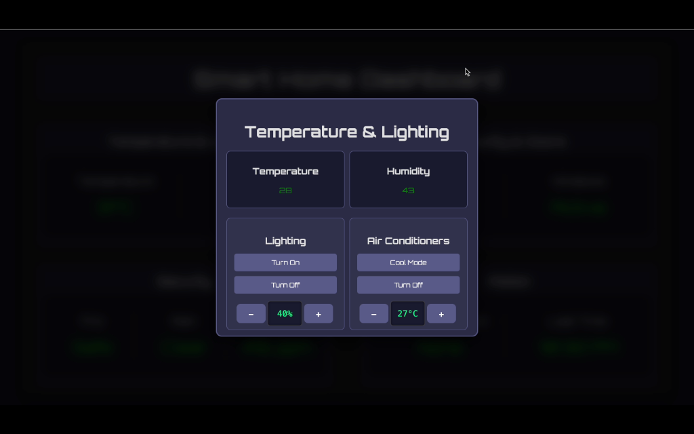
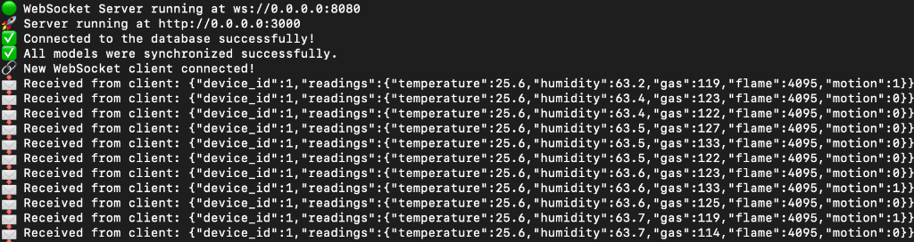
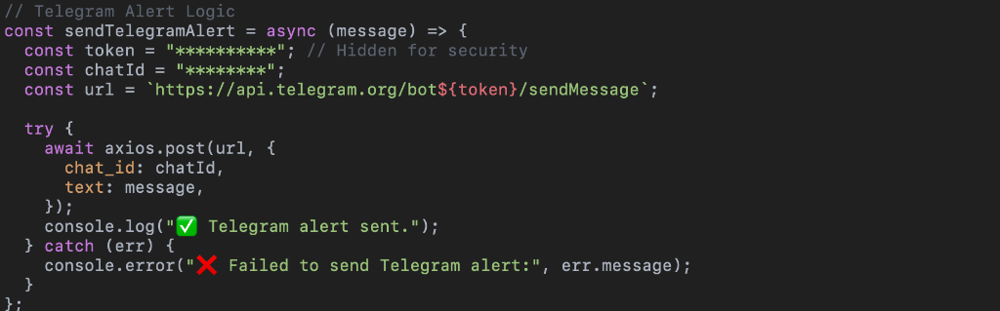
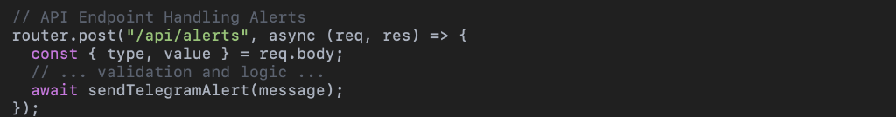
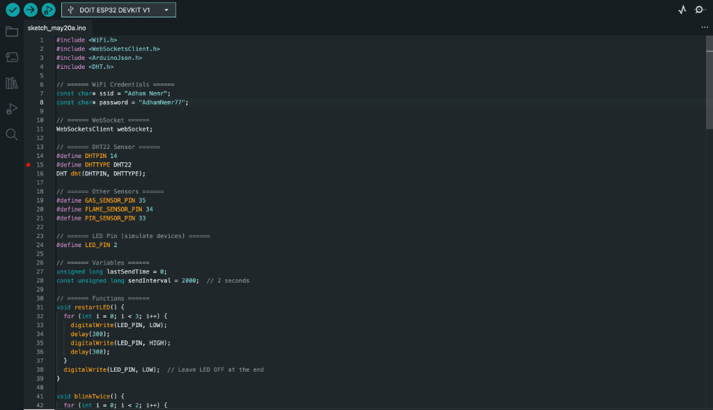

# 🏠 MySmartHome - IoT Home Automation System

A full-stack IoT home automation system that enables real-time monitoring and control of smart home devices through a web interface, WebSocket communication, and Telegram bot integration.


## 📸 Screenshots

### Dashboard Interface

*Modern, responsive dashboard for controlling smart home devices with real-time sensor data*

### Real-time WebSocket Communication

*Live sensor data streaming via WebSocket - temperature, humidity, gas, flame, and motion detection*

### Telegram Bot Integration

*Automated Telegram alerts for critical events and remote control capabilities*

### API Endpoints

*RESTful API handling alerts and device commands*

### IoT Device Code (ESP32/Arduino)

*Arduino/ESP32 firmware for sensor integration and WebSocket communication*

## 🌟 Features

### Core Functionality
- **Real-time Device Control**: Control smart home devices instantly via WebSocket connections
- **Multi-Room Management**: Organize and manage devices across different rooms
- **Sensor Data Logging**: Track and store sensor readings (temperature, humidity, motion, etc.)
- **User Authentication**: Secure login system with bcrypt password hashing
- **Telegram Bot Integration**: Control your home remotely through Telegram commands
- **RESTful API**: Comprehensive API for device management and data retrieval

### Technical Highlights
- **WebSocket Server**: Bi-directional real-time communication on port 8080
- **Express Backend**: Robust REST API with proper middleware architecture
- **Database ORM**: Sequelize for database operations and migrations
- **CORS Enabled**: Configured for both local development and production deployment
- **Responsive Dashboard**: Clean web interface for device monitoring and control

## 🏗️ Architecture

```
MySmartHome/
├── config/          # Database configuration
├── controllers/     # Business logic handlers
├── models/          # Sequelize database models
├── routes/          # API route definitions
├── middleware/      # Custom middleware functions
├── public/          # Frontend static files
│   ├── css/        # Stylesheets
│   ├── js/         # Client-side JavaScript
│   └── images/     # UI assets
├── scripts/         # Utility scripts
├── __tests__/       # Jest test suites
└── server.js        # Main application entry point
```

## 🚀 Quick Start

### Prerequisites
- Node.js (v14 or higher)
- npm or yarn
- SQLite (or your preferred SQL database)

### Installation

1. **Clone the repository**
```bash
git clone https://github.com/adhamNemr/MySmartHome.git
cd MySmartHome
```

2. **Install dependencies**
```bash
npm install
```

3. **Configure environment variables**
```bash
cp .env.example .env
# Edit .env with your configuration
```

4. **Initialize the database**
```bash
node createUser.js  # Create initial admin user
```

5. **Start the server**
```bash
npm start
```

The application will be available at:
- **Web Interface**: http://localhost:3000
- **WebSocket Server**: ws://localhost:8080

## 🔧 API Endpoints

### Authentication
- `POST /api/login` - User authentication

### Device Management
- `GET /api/devices` - List all devices
- `POST /api/devices` - Create new device
- `PUT /api/devices/:id` - Update device
- `DELETE /api/devices/:id` - Remove device

### Room Management
- `GET /api/rooms` - List all rooms
- `POST /api/rooms` - Create new room

### Sensor Data
- `GET /api/sensors-data` - Retrieve sensor readings
- `POST /log-sensor` - Log new sensor data

### System Logs
- `GET /api/logs` - Fetch system logs

### Commands
- `POST /api/commands` - Send device commands

## 🧪 Testing

Run the test suite:
```bash
npm test
```

## 🌐 Deployment

The application is configured for deployment on platforms like:
- **Vercel** (Optimized for frontend deployment)
- **Railway** / **Render** (Backend)
- **Heroku**

CORS is pre-configured for production deployment.

## 🔐 Security Features

- Password hashing with bcrypt
- JWT-ready architecture
- Environment variable protection
- CORS configuration
- Input validation middleware

## 📊 Database Schema

The system uses the following main models:
- **User**: Authentication and user management
- **Device**: Smart device information
- **Room**: Room organization
- **SensorLog**: Historical sensor data
- **Command**: Device command history

## 🤖 Telegram Integration

Control your smart home via Telegram bot commands. Configure your bot token in the `.env` file.

## 🛠️ Tech Stack

**Backend:**
- Node.js & Express.js
- WebSocket (ws library)
- Sequelize ORM
- bcrypt for password hashing
- JWT for authentication

**Frontend:**
- Vanilla JavaScript
- HTML5 & CSS3
- WebSocket client

**Testing:**
- Jest

## 📝 Environment Variables

Create a `.env` file with the following variables:

```env
# Database
DATABASE_URL=your_database_url

# JWT Secret
JWT_SECRET=your_jwt_secret

# Telegram Bot
TELEGRAM_BOT_TOKEN=your_telegram_bot_token

# Server Configuration
PORT=3000
WEBSOCKET_PORT=8080
```

## 🤝 Contributing

Contributions are welcome! Please feel free to submit a Pull Request.

## 📄 License

This project is licensed under the ISC License.

## 👨‍💻 Author

**Adham Nemr**
- GitHub: [@adhamNemr](https://github.com/adhamNemr)
- LinkedIn: [Adham Nemr](https://www.linkedin.com/in/adham-nemr)

## 🙏 Acknowledgments

Built as a comprehensive IoT solution demonstrating full-stack development skills, real-time communication, and modern web technologies.

---

⭐ If you find this project useful, please consider giving it a star on GitHub!
